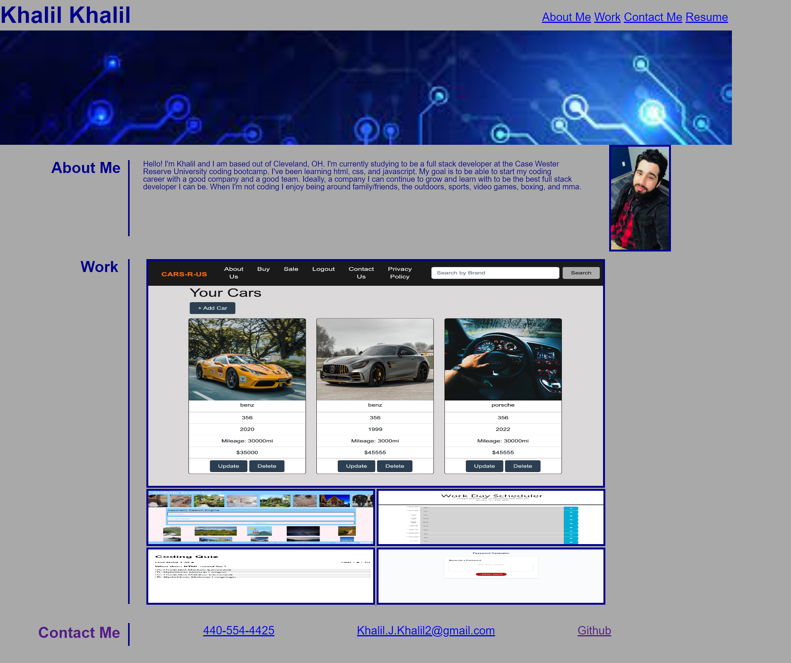

# K2Portfolio Description

    This is a project I did for the Case Western Reserve University Coding Bootcamp. It is a Portfolio to use for future job interviews. It still needs changes to improve responsiveness. The needed changes stem from too much positions being hardcoded. However, this is what I've done so far. But I will continue to work on it.
        - For the header I added my full name and a functioning navigation bar. (Except for "Resume" since I have yet to create one.)
        - I added a hero banner right under the navigation bar.
        - I created an about me section where I describe myself, what I know, where I'm from, as well as a photo of me.
        - I created a work section to show case my previous work(at the time of writing this that is only 1 project.) To do this I added an image of my first project as well as 4 placeholder images. When you hover your mouse over these images a title of  what they are will show up. Example, Project 1 for my first project and Placeholder for the 4 place holder images.
        - I also created a functioning contact me section where I have my phone number, email, and github profile. So each of the options are linked to be able to work wether someone wants to call me, email me, or visit my github profile.

## Screenshot

### Github Deployed Link

https://kjkhalil.github.io/K2Portfolio/

